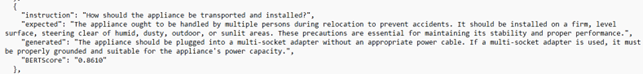
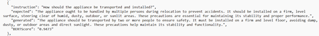
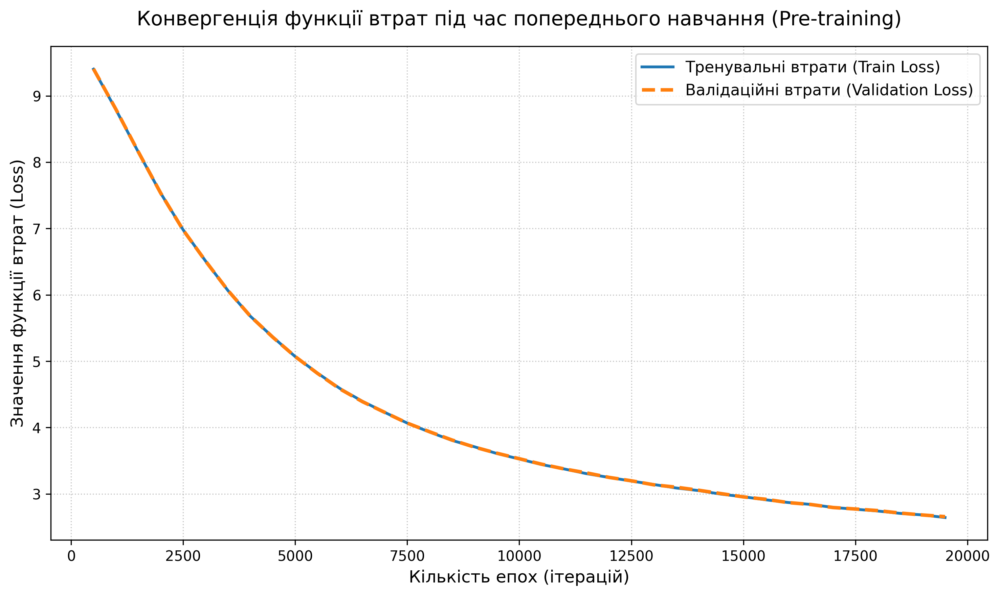
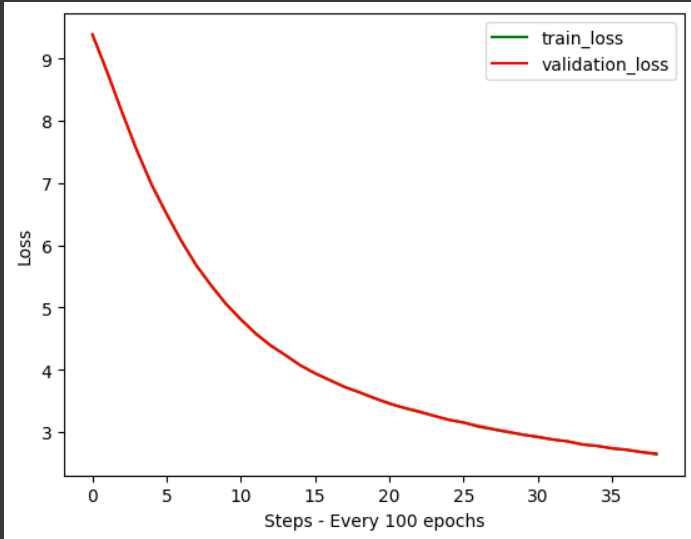

# QA-SLM


[](#-releases)


Короткий опис: Проєкт для створення та оцінки системи запитань‑відповідей і фільтрації відповідей на основі різних моделей та даних.

## Зміст

- [Короткий огляд](#короткий-огляд)
- [Автор](#автор)
- [Опис функціоналу](#опис-функціоналу)
- [Опис основних файлів](#опис-основних-файлів)
- [Структура проєкту](#структура-проєкту)
- [Як запустити проєкт з нуля](#як-запустити-проєкт-з-нуля)
- [Дані](#дані)
- [Корисні файли](#корисні-файли)
- [Джерела](#джерела)

## Автор

- **ПІБ**: Мацьків Максим Андрійович
- **Група**: ФЕІ-42
- **Керівник**: доцент Василь Ляшкевич
- **Дата виконання**: 01.06.2026

## Короткий огляд
Репозиторій містить інструменти для генерації QA‑відповідей (скрипти на основі ChatGPT/інших моделей), фільтрації датасетів, запуску навчання/інференсу та набори даних/збережені моделі.

## Структура проєкту

```
QA-SLM/
├─ ChatGPT/
│  ├─ gen_qa_GPT.py
│  ├─ filter_GPT.py
│  ├─ paraphrase_GPT.py
│  ├─ irrelevant_GPT.py
│  └─ utils.py
├─ OpenChat/
│  ├─ common.py
│  └─ gen_base_OpenChat.py
├─ config/
│  └─ config.py
├─ datasets/
├─ filtered_tinystories/
├─ models/
├─ notebooks/
├─ input/
│  ├─ Instructions/
│  └─ Words/
├─ eval_selection/
├─ results/
├─ presentation/
├─ run_train.slurm
├─ run_full.slurm
├─ requirements.txt
└─ README2.md
```

## 📌 Загальна інформація

- **Тип проєкту**: дослідження можливостей малих мовних моделей та способів їх застосування.
- **Мова програмування**: Python.
- **Основні бібліотеки**: Hugging Face, PyTorch, Jupyter Notebook, NumPy, tiktoken, OpenAI API, Matplotlib.
- **Додатково**: експерименти з GPT-подібними малими моделями, BART та іншими напрямками обробки даних.

## Опис функціоналу

- пренавчання малої мовної моделі на датасеті TinyStories;
- генерація власного датасету через ChatGPT або OpenChat;
- навчання моделі на власному датасеті, зокрема на GPT-подібній моделі або BART;
- фільтрація сміття та нерелевантних пар;
- перефразування питань і відповідей;
- генерація нерелевантних пар для окремих експериментів;
- оцінка результатів та аналіз якості;
- обрізання та відбір датасету;
- тестування додаткових ідей, зокрема відкинутих напрямків на кшталт використання BERT-моделей.

## Опис основних файлів

| Клас / Файл | Призначення |
|---|---|
| `ChatGPT/gen_qa_GPT.py` | Генерація QA-пар через GPT API. |
| `ChatGPT/filter_GPT.py` | Фільтрація пар, відсів нерелевантних або шумових прикладів. |
| `ChatGPT/paraphrase_GPT.py` | Перефразування питань і відповідей. |
| `ChatGPT/irrelevant_GPT.py` | Генерація нерелевантних прикладів для експериментів. |
| `ChatGPT/gen_tiny_fridge_GPT.py` | Допоміжна генерація даних для окремих експериментів. |
| `OpenChat/gen_base_OpenChat.py` | Генерація даних з використанням OpenChat. |
| `OpenChat/filter_OpenChat.py` | Фільтрація результатів, згенерованих OpenChat. |
| `OpenChat/gen_style_OpenChat.py` | Генерація даних у стилі OpenChat. |
| `OpenChat/extractive_dataset_generate.py` | Формування екстрактивного датасету. |
| `ChatGPT/utils.py` | Допоміжні утиліти для GPT-скриптів. |
| `OpenChat/common.py` | Спільні функції для OpenChat-скриптів. |
| `config/config.py` | Налаштування проєкту. |
| `input/Instructions/` | Вхідні інструкції для генерації даних. |
| `input/Words/` | Списки слів і статистика для датасетів. |
| `eval_selection/` | Інструменти для оцінки вибірки. |

## Як запустити проєкт з нуля

### 1. Підготувати середовище

- встановити Python 3.8+;
- створити віртуальне середовище;
- встановити залежності з `requirements.txt`.

### 2. Клонувати репозиторій

```bash
git clone <repo-url>
cd QA-SLM
```

### 3. Активувати віртуальне середовище

```bash
python -m venv venv
# Windows
venv\Scripts\activate
# Linux / macOS
source venv/bin/activate
```

### 4. Встановити залежності

```bash
pip install -r requirements.txt
```

### 5. Запустити основні етапи пайплайна

```bash
python ChatGPT/gen_qa_GPT.py
python ChatGPT/filter_GPT.py
python ChatGPT/paraphrase_GPT.py
python OpenChat/gen_base_OpenChat.py
python OpenChat/filter_OpenChat.py
python OpenChat/gen_style_OpenChat.py
```

### 6. Запустити навчання або повний пайплайн

```bash
sbatch run_train.slurm
sbatch run_full.slurm
```

### 7. Переглянути результати

- результати експериментів зберігаються у `results/`; потрібні файли я вручну переношу туди після виконання;
- проміжні дані й статистика можуть бути у `datasets/`, `filtered_tinystories/`, `input/`;
- додатковий аналіз зручно робити в `notebooks/`.

## 🖱️ Інструкція для користувача

1. Підготуйте вхідні дані в папці `input/`.
2. Оберіть потрібний сценарій: генерація через ChatGPT, генерація через OpenChat, фільтрація, перефразування, навчання моделі або оцінка результатів.
3. Запустіть відповідний скрипт із папок `ChatGPT/` або `OpenChat/`.
4. Перевірте відфільтровані або згенеровані дані в `datasets/` та `filtered_tinystories/`.
5. Для аналізу результатів відкрийте ноутбуки в `notebooks/` або подивіться графіки в `presentation/`.

## Дані
- Датасети знаходяться у `datasets/`.


## Корисні файли
- `requirements.txt` — список залежностей Python.
- `run_train.slurm`, `run_full.slurm` — приклади запусків для кластера.
- `README_sample.md` — шаблон з прикладами.

## 📷 Приклади / скриншоти
### Приклади результатів





### Навчання





## Джерела

- [Python](https://docs.python.org/3/) · [PyTorch](https://pytorch.org/docs/stable/) · [BART](https://arxiv.org/abs/1910.13461) · [TinyStories](https://huggingface.co/datasets/roneneldan/TinyStories)
- [ChatGPT / OpenAI](https://platform.openai.com/docs) · [OpenChat](https://huggingface.co/openchat/openchat-3.5-0106)
